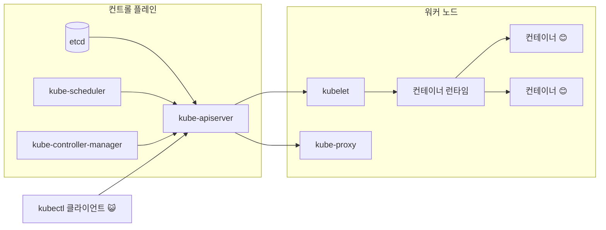

+++
date = 2025-11-16T21:40:00+09:00
title = "[그림과 실습으로 배우는 쿠버네티스 입문] 2장. 쿠버네티스 클러스터 만들어 보기"
authors = ["Ji-Hoon Kim"]
tags = ["k8s", "kubernetes"]
categories = ["k8s", "kubernetes"]
series = ["k8s", "kubernetes"]
+++


## 2.1 쿠버네티스란?

- 쿠버네티스는 ‘컨테이너화된 애플리케이션의 배포, 확장, 관리를 자동화하는 오픈 소스 시스템’

### 2.1.1 컨테이너를 쉽게 만들고 파기할 수 있게 된 이후의 상황

- 도커의 등장으로 컨테이너를 쉽게 만들고 파기할 수 있게 됨
- 도커 컨테이너는 무척 편리하지만, 현장에서 많은 컨테이너를 운영하려고 하면 다음과 같은 문제를 만남
    - 장애 발생 시, 각 컨테이너의 설정 및 복구가 어렵다.
    - 컨테이너의 사양을 개별적으로 관리하기 어렵다.
    - 서버가 여러 대일 때 어떤 서버에서 컨테이너를 실행해야 할지 결정하기 어렵다.
- 이러한 문제를 해결하기 위한 방법 중 하나가 쿠버네티스
- **반대로 컨테이너를 사용한다고 해서 반드시 쿠버네티스를 사용하는 것이 최선은 아님**

### 2.1.2 쿠버네티스의 특징

- 장애 발생 시, 각 컨테이너의 설정 및 복구가 어렵다.
    - Reconciliation Loop (조정 루프) 에 의해 자동 복구를 시도한다.
- 컨테이너의 사양을 개별적으로 관리하기 어렵다.
    - YAML 파일로 설정을 관리할 수 있다. (Infrastructure as Code)
- 서버가 여러 대일 때 어떤 서버에서 컨테이너를 실행해야 할지 결정하기 어렵다.
    - 쿠버네티스의 API 로 인프라 레이어가 추상화되어 있어, 서버 고유의 설정을 알 필요가 없다.

**Reconciliation Loop (조정 루프) 에 의해 자동 복구를 시도한다.**

- 쿠버네티스는 ‘선언형’ 도구
- ‘절차형’ 도구로는 앤서블 (Ansible) 이 많이 사용됨
- 절차형
    - 해야 할 일을 순서대로 적어 실행하는 단순함이 있음
    - 장애나 오류가 발생했을 경우 그 오류를 자동으로 해결하기 위한 오류 처리 절차까지 작성해야 함
- 선언형
    - 바람직한 상태 (Desired State) 를 정의하는 방식으로 인프라를 설정
    - 바람직한 상태를 정의해두면 쿠버네티스는 정의된 대로 설정이 되도록 자동으로 컨테이너를 시작하거나 네트워크를 설정함
    - 이렇게 바람직한 상태를 달성하기 위해 자동으로 작동하는 메커니즘을 Reconciliation Loop 라고 함
    - 이 루프 덕분에 쿠버네티스는 장애에 강함
- Reconciliation Loop 는 항상 실행되기 때문에, 사람이 서버의 장애를 눈치채지 못하는 사이에 복구될 수 있음

**YAML 파일로 설정을 관리할 수 있다. (Infrastructure as Code)**

- IaC 는 수동 프로세스가 아니라 코드를 사용하여 인프라스트럭처를 관리하고 프로비저닝하는 것을 의미
- 쿠버네티스는 YAML 파일을 사용하는데, 이를 ‘매니페스트’라고 부르곤 한다.
- IaC 의 장점은 소스 코드 리포지터리를 이용함으로써 변경점을 나중에 쉽게 확인할 수 있다는 점
- 더 나아가 쿠버네티스에서는 나중에 설명할 GitOps 를 사용하여 ‘Git 리포지터리에 저장되어 있는 매니페스트가 반드시 참’인 상태를 만들 수 있음
- IaC 는 UI 에서 클릭 한 번으로 끝나는 작업도 코드화해야 한다는 번거로움이 있지만, 본격적인 운영 환경에서는 되도록 도입하는 것이 좋음
- 쿠버네티스에서는 리소스를 만들어 애플리케이션을 배포하고 설정함
- 컨테이너는 Pod 이라는 리소스를 사용하여 배포함
    - Pod 은 여러 개의 컨테이너를 하나로 묶은 단위
- 컨테이너의 ‘사양’을 모두 매니페스트에 기록하고, 이 사양을 바탕으로 컨테이너가 실행됨
- 쿠버네티스는 컨테이너를 포함한 인프라 레이어의 대부분을 코드화하는 것으로 ‘컨테이너의 사양과 설정을 개별적으로 관리하기 어렵다’는 문제를 해결함

**쿠버네티스의 API 로 인프라 레이어가 추상화되어 있어, 서버 고유의 설정을 알 필요가 없다.**

- 서버 위에서 애플리케이션을 실행하는 경우 그 서버에 맞춘 고유한 설정이 필요할 수 있다.
- 쿠버네티스에는 다양한 인프라 레이어의 설정이 공통화, 추상화되어 있기 때문에, 지금까지 인프라를 많이 다뤄보지 않은 개발자라도 인프라 관련 설정을 할 수 있음

### 2.1.3 쿠버네티스 아키텍처 개요



- 컨트롤 플레인이 워커 노드에 직접 지시하지 않음
- 워커 노드가 컨트롤 플레인에 질의하는 방식을 취하기 때문에 컨트롤 플레인에 문제가 생겨도 곧바로 워커 노드에서 실행 중인 컨테이너에 문제가 생기지 않음

### 2.1.4 다양한 쿠버네티스 클러스터 구축 방법

- 로컬 클러스터 구축하기
    - https://minikube.sigs.k8s.io/docs/start/
    - https://kind.sigs.k8s.io/
    - https://k3s.io/
- 클라우드 사용하기
    - https://cloud.google.com/kubernetes-engine
    - https://aws.amazon.com/ko/eks/
    - https://azure.microsoft.com/en-us/products/kubernetes-service
- 브라우저로 사용할 수 있는 외부 서비스
    - https://labs.play-with-k8s.com/
    - https://killercoda.com/

## 2.2 [만들고 고치기] 쿠버네티스 클러스터 만들고 지우기

- kind create cluster 에서 기본 노드 이미지 확인하는 방법
    - https://github.com/kubernetes-sigs/kind/releases

```bash
~                                                                      21:10:08
❯ kind create cluster                             
Creating cluster "kind" ...
 ✓ Ensuring node image (kindest/node:v1.34.0) 🖼 
 ✓ Preparing nodes 📦  
 ✓ Writing configuration 📜 
 ✓ Starting control-plane 🕹️ 
 ✓ Installing CNI 🔌 
 ✓ Installing StorageClass 💾 
Set kubectl context to "kind-kind"
You can now use your cluster with:

kubectl cluster-info --context kind-kind

Have a question, bug, or feature request? Let us know! https://kind.sigs.k8s.io/#community 🙂

~                                                                  58s 21:14:18
❯ kubectl cluster-info --context kind-kind
Kubernetes control plane is running at https://127.0.0.1:53470
CoreDNS is running at https://127.0.0.1:53470/api/v1/namespaces/kube-system/services/kube-dns:dns/proxy

To further debug and diagnose cluster problems, use 'kubectl cluster-info dump'.

~                                                                      21:17:19
❯ cat ~/.kube/config 
apiVersion: v1
clusters:
- cluster:
    certificate-authority-data: LS0tLS1CRUdJTiBDRVJUSUZJQ0FURS0tLS0tCk1JSURCVENDQWUyZ0F3SUJBZ0lJTjNQMWsydkVHSW93RFFZSktvWklodmNOQVFFTEJRQXdGVEVUTUJFR0ExVUUKQXhNS2EzVmlaWEp1WlhSbGN6QWVGdzB5TlRFeE1UWXhNakE1TURkYUZ3MHpOVEV4TVRReE1qRTBNRGRhTUJVeApFekFSQmdOVkJBTVRDbXQxWW1WeWJtVjBaWE13Z2dFaU1BMEdDU3FHU0liM0RRRUJBUVVBQTRJQkR3QXdnZ0VLCkFvSUJBUUMvVllPaWVuOGE2Qkp4SkVUN08wbjZqelM0eWQvelJlY0E0M1ZZUEJMNGR3RHFPK25QaUJ3SUZkRzAKeURPdVR6RW1KcUtmalZzeVZRL0s0aW9kZ3F3MEdibE9nRllCR1VWNFljaC9MdjNHeSsxNzBuWmVWRjRHbGRYUAoxS2EyNnA0b09QMzdUQkJXell3eDNGcjVvMG5zYWlkRS9qRThLT0p2a3V1ci9iT2JTM01kTHdYZlB0YzVIc3Y0CndqcGRRbWNDVGRlWUhLK0RPbnBUekZnWkFvTUZJbGR5K0d4aUttK3pBRTNaY1ZWV1ZnaGo4NnVjQXZqM01HNUUKaXZHNFlWNzZRWnVjZGovWjhYVGo2ZUR4TFNDN2plbTJFYXVXdFE4YXFSaVVaWlNFOC9oOVk1bWxzVkVxaEtHcwpyRHRYbXNlWEFrS251Ti83Sk1YKytVM2J2WHQvQWdNQkFBR2pXVEJYTUE0R0ExVWREd0VCL3dRRUF3SUNwREFQCkJnTlZIUk1CQWY4RUJUQURBUUgvTUIwR0ExVWREZ1FXQkJTMGc0YlgyMGpkUVhjbGJaOHRvSWE5MnF5dTF6QVYKQmdOVkhSRUVEakFNZ2dwcmRXSmxjbTVsZEdWek1BMEdDU3FHU0liM0RRRUJDd1VBQTRJQkFRQWdURnlrRmhDLworTjNsenFZWUh1VVFvNms5MWUzVWNyM0JXS3d2M0xPSU5FSzE0ZjF4VkdaOEcwYzFpMUhuY0hVZ2x5cFJQbFl5CmlmaXd0SlNZMFV0WmJxd05oa21INEZmSnVBdWxhT1AxSnpwOHUrTXBvUHc3M0Erb0RSek1Ic3pJRlppNVRGa3cKeVZFQUZxMlBlSWR1dzZZQkI5OGltbDNpd0RMYWpITDFmZ2tnWjl0bEh3aU03NTB1cnk5NDZqeTlDZ2d4cmhUSgo4TFA4aWl2M21IbC9hUDJIblJKQmJWN0ZGeWpPc1JIV0h5TmlCUEdON1lpSFp3QlRkd1FZRktTZmxIM1dLK081CkFjd0J4bXRuVDB4bUhTejRCMytIUDh2b1A1Z004aUU1K0UwQ1VQbjRWYUNnUEY5QVJ5NlF5WjNTcDRJQnRwS00KRCtyNTdrL28zcWFRCi0tLS0tRU5EIENFUlRJRklDQVRFLS0tLS0K
    server: https://127.0.0.1:53470
  name: kind-kind
- cluster:
    certificate-authority: /Users/bossm0n5t3r/.minikube/ca.crt
    extensions:
    - extension:
        last-update: Mon, 03 Nov 2025 23:27:20 KST
        provider: minikube.sigs.k8s.io
        version: v1.37.0
      name: cluster_info
    server: https://127.0.0.1:32771
  name: minikube
contexts:
- context:
    cluster: kind-kind
    user: kind-kind
  name: kind-kind
- context:
    cluster: minikube
    extensions:
    - extension:
        last-update: Mon, 03 Nov 2025 23:27:20 KST
        provider: minikube.sigs.k8s.io
        version: v1.37.0
      name: context_info
    namespace: default
    user: minikube
  name: minikube
current-context: kind-kind
kind: Config
preferences: {}
users:
- name: kind-kind
  user:
    client-certificate-data: LS0tLS1CRUdJTiBDRVJUSUZJQ0FURS0tLS0tCk1JSURLVENDQWhHZ0F3SUJBZ0lJTXhPaHo1S3I4NzB3RFFZSktvWklodmNOQVFFTEJRQXdGVEVUTUJFR0ExVUUKQXhNS2EzVmlaWEp1WlhSbGN6QWVGdzB5TlRFeE1UWXhNakE1TURkYUZ3MHlOakV4TVRZeE1qRTBNRGRhTUR3eApIekFkQmdOVkJBb1RGbXQxWW1WaFpHMDZZMngxYzNSbGNpMWhaRzFwYm5NeEdUQVhCZ05WQkFNVEVHdDFZbVZ5CmJtVjBaWE10WVdSdGFXNHdnZ0VpTUEwR0NTcUdTSWIzRFFFQkFRVUFBNElCRHdBd2dnRUtBb0lCQVFDekpSM3oKMnBJZmxtQXpoUG55U3NkM3prUTZ6OUhtM1llQUhJVDBGZ3A4MFpsSndXbkxiWVcrMG9RNXlQNG02akZCWU5PNwo0S1ZOeVZXSGMyREF5YXB5NXg4emVjVDNPR2IzSjY5UEQ3UmFxZDlKdUVqY3pBQXBudnRkT3d5OUhHeDBtNjNrCm04dzhzWWV5VkhONnBJaXZ0Z2pFMEJqMytLL0JxQlpLeDdJN2FGa3VTME1CWGJQVU0rSXdNdy9PVm5IVVNHZ0EKNjhROEptUDNERzRvaVV2clF0Y1I3QTROV1dQaEVNWHY5SjZwZlMxLzQyNXdEOHNwOWZSWWxwQ050VHNMb1lPZAo0ajZBWnZ0ejk4d0xZVG16REFLL3IyU2xkRmtZVHl2R0I1Rmp0T2tIdzhORzdMOFEyeHFZQ1BnZWR5UGRsVG5DCkduOHVyVmxDclh1aE03ZUhBZ01CQUFHalZqQlVNQTRHQTFVZER3RUIvd1FFQXdJRm9EQVRCZ05WSFNVRUREQUsKQmdnckJnRUZCUWNEQWpBTUJnTlZIUk1CQWY4RUFqQUFNQjhHQTFVZEl3UVlNQmFBRkxTRGh0ZmJTTjFCZHlWdApueTJnaHIzYXJLN1hNQTBHQ1NxR1NJYjNEUUVCQ3dVQUE0SUJBUUI3MlZKb0dCNHZRSFJ4bDdFQ1RZdTVSMDBDClNReWJrVlJyNmxYY0dyT0g3TUEzV1BTelhkeXIrQXZnYzJQTnlKRTdKSGtCa0NRN2pnSmtvK3hjWm5KQTVkOFIKY1hLcWIydklDVmZoTEQ1WmhBeDVuN3c0dXhjZVlUODlCSjdVdmpQRTFrejUveVNRbVFpenhoUVVOYlJUeEtCcwpjZFlMRzhURHZ2UnNxT1lOMlRIY002Z1huTVNpQUQ5OVo5azBIRUFDNGREU2pMR3JBSWtLclFHWlkrVjZSQ2hSCjFGN3ArZ2NMZy90ZGZLRXJSS0R3bm1EbzdQY2VESXBEcnhlbUUvN1hiRnpSMHZXbk1KS21FSUFLd2ZTM1BMbUwKMWJtaEhqK25LN2RLem8rd0dNcUhrOXgxN3dCTC85SjNHOXFRYVkveFp0SlNseVBZRHZ3U1lJSmhVbGdKCi0tLS0tRU5EIENFUlRJRklDQVRFLS0tLS0K
    client-key-data: LS0tLS1CRUdJTiBSU0EgUFJJVkFURSBLRVktLS0tLQpNSUlFcEFJQkFBS0NBUUVBc3lVZDg5cVNINVpnTTRUNThrckhkODVFT3MvUjV0MkhnQnlFOUJZS2ZOR1pTY0ZwCnkyMkZ2dEtFT2NqK0p1b3hRV0RUdStDbFRjbFZoM05nd01tcWN1Y2ZNM25FOXpobTl5ZXZUdyswV3FuZlNiaEkKM013QUtaNzdYVHNNdlJ4c2RKdXQ1SnZNUExHSHNsUnplcVNJcjdZSXhOQVk5L2l2d2FnV1NzZXlPMmhaTGt0RApBVjJ6MURQaU1ETVB6bFp4MUVob0FPdkVQQ1pqOXd4dUtJbEw2MExYRWV3T0RWbGo0UkRGNy9TZXFYMHRmK051CmNBL0xLZlgwV0phUWpiVTdDNkdEbmVJK2dHYjdjL2ZNQzJFNXN3d0N2NjlrcFhSWkdFOHJ4Z2VSWTdUcEI4UEQKUnV5L0VOc2FtQWo0SG5jajNaVTV3aHAvTHExWlFxMTdvVE8zaHdJREFRQUJBb0lCQURmNlZLb3l0YTlPSDJCcAo0R3BnQ0lVOHZHQStPU0l4UGRwL3p1R3drM1ZlVDA1WE5CWS9jbWZtd3krRlNUbGl1NkpvdmJDNjZSeHQyWjU2CkpKVUpUd3daZ1V2bDlIQ2x2TExsUVNmc3lkZjh0Y3VFM0t1MXlTVTRTdVplZ2NRRUFqWEx3YUlxTnI4T1lFOE8KaVlrY3FhTnlON284SmxreDZjV1RIdWdlRDJqMVU5STNJNU9Hd1duSFQrOEhVUk1oMFdwSXI2SloxTms2QkE3WQpWc1NTa2RrWGRNSDFucEZWVXVyblpjWDd6TGg0ZDQ4NXpDdzQ0MGNjZXlpSFZkZUd1RjJaaEtXci8zWnJTeDl6CkdURkVCd1dSMzNRbSs0a1JTMnhFZ1ZjcGR1dHBPWXRlLzh2bGtyVHVIOUhrMTRhVnFEY2NaR0pZOVExWWNYN2wKbUFTaUtHVUNnWUVBNEVkZitkcEZwRUdFV3FIQXI3UGZNbXVaS1dxYThzYjRoVzNGbGJvRzdQcWxvNVp5Z0FkTwowUUtNMFNSWUZBMGdwcWsrd2lWSU1wejRUWXdldlR3aU9SUXBrOXZuY2RSRUx5UXE4Y2dnSTdvNkxvK3kwOWxrCm5GTlV4TmhZVStIRnhBMVBtLzFUa3hzL2x2VUdjL1o2SnNoZ3JsQmhSdHVJaSt1alZUeUJTUVVDZ1lFQXpIdU0KbWFUZndla2UxQ24rRnpGRE4rSFJNUlh4dUtMdGo1NmtZRGxXc1pNL1J3RHBRQWZ1Sis3N1Fhbzdyb3FSL2lVUQpNMjdacmJDWEZ6YUxiMHp4SDBiK21YNG5kcTM5TnF3M2VqVVdoRUQ1NjBPSjc2V3Q5aXFudlFoZEtodVJrQ3FPCmhBdXJvTVl2OXpoUm1SaWR0eU1KUXFYOTZGVjVxUW9TQlRhTU5Cc0NnWUVBbHo0cXI5QU05S2FsL1lSazcxZksKSlROQU54akg0djVncTRJS0kxMHV2SEtPYnRITzV4MkdmaFpOSmVCdmNSNGxMWjZtVHNCYmZwNHlLQUZjM1ZvRwo3aHoxcU5zN3FaeHVXcWYyT2RRdU1FbXVZS1hRLzJIem9pUGozMWJSd2NkWDJVenNxWkhjNFRBWDR0SGJoeW5vCjEreDZuakpnVnl0R1dxME9HVFhUTFkwQ2dZQUNHeWVva1hVb2h5RWxLRVdRc1pZeXBpWEVicWh0c1dmbStjaFIKb1dXT01La1BMeWczMjUwTlZqM0tRRm1iQTV4YlZNQms5emhRdktmaHVsTVhVMkNNWk92TVl1cy9JcTJmK1lnYwp2eDA3UVh3UmUwR1pjVWhvWjZvUW5WeHdTWlpuT0xqOURTMjRXekkxUnFRNGduTmxabnY2N3NDOXV0dWs3UkNnCmN4NWdqd0tCZ1FDWXpuMVBHVUxrV2s0NWZnR2tKa1M2Y3F6SzhXR3A0NDBzT212MlNnSERGMEVlVmtCM1FEOTEKUzZjSVpzRUhLb01FWlJyU2kzamNPOUlEV2wxTXNJeXIzeDkwS21JQVdYeGxCeG1QbWtNZHJsWmtRcjRvMEZ1bgpIUGhTaWd6QVMyNG1GeXAybTBGRzd0VlI1cnpiNGUxVE4rUGxLd0cyTUVSZk5NVW9nNjdvVFE9PQotLS0tLUVORCBSU0EgUFJJVkFURSBLRVktLS0tLQo=
- name: minikube
  user:
    client-certificate: /Users/bossm0n5t3r/.minikube/profiles/minikube/client.crt
    client-key: /Users/bossm0n5t3r/.minikube/profiles/minikube/client.key

~                                                                      21:17:35
❯ kind delete cluster                     
Deleting cluster "kind" ...
Deleted nodes: ["kind-control-plane"]

~                                                                      21:19:15
❯ kind get clusters
No kind clusters found.
```
