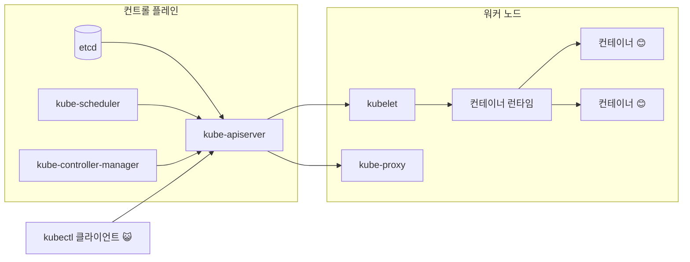

+++
date = 2025-11-21T22:00:00+09:00
title = "[그림과 실습으로 배우는 쿠버네티스 입문] 4장. 쿠버네티스 클러스터 위에 애플리케이션 만들기"
authors = ["Ji-Hoon Kim"]
tags = ["k8s", "kubernetes"]
categories = ["k8s", "kubernetes"]
series = ["k8s", "kubernetes"]
+++


## 4.1 쿠버네티스 클러스터 위에 애플리케이션 실행하기

### 4.1.1 리소스의 사양을 담은 매니페스트

- 쿠버네티스 위에 애플리케이션을 실행하기 위한 수단 중 하나는 매니페스트를 이용하는 것
- 매니페스트는 일반적으로 `.yaml` / `.yml` 확장자를 가진 YAML 형식의 파일로, 그 안에 실행하고 싶은 리소스의 ‘사양’을 작성함
- YAML 형식 외에 JSON 형식으로도 작성 가능

```yaml
apiVersion: v1
kind: Pod
metadata:
  name: nginx
spec:
  containers:
    - name: nginx
      image: nginx:latest
      ports:
        - containerPort: 80
```

- 매니페스트를 바탕으로 애플리케이션을 실행하기 위해서는 `kubectl` 을 사용해야 함
- `kubectl` 을 사용해 쿠버네티스 클러스터와 통신함으로써, 쿠버네티스에 애플리케이션의 컨테이너를 실행할 수 있음

### 4.1.2 컨테이너를 실행하기 위한 최소 구성 리소스: Pod

- 컨테이너를 실행하기 위한 쿠버네티스의 리소스에는 여러 종류가 있지만, 가장 작은 단위로 Pod 라는 리소스가 있음

```yaml
apiVersion: v1
kind: Pod
metadata:
  name: nginx
spec:
  containers:
    - name: nginx
      image: nginx:latest
      ports:
        - containerPort: 80
```

- 위 매니페스트가 바로 Pod 를 생성하기 위한 매니페스트
- 이번에는 컨테이너를 하나만 지정했지만, Pod 에는 컨테이너를 여러 개 담을 수 있음
    - 예를 들어 A 라는 서비스와 로그를 전송하는 서비스가 있을 때, 이들을 하나의 Pod 에서 실행하는 경우가 많음
    - 일반적으로 이렇게 메인 서비스에 부속되는 프로그램을 ‘사이드카’라고 부름
- 매니페스트에 어떤 설정을 할 수 있는지는 아래 링크를 참고
    - https://kubernetes.io/docs/reference/generated/kubernetes-api/v1.29/

### 4.1.3 리소스가 만들어지는 공간: 네임스페이스

- Pod 를 생성할 때 중요한 개념 중 하나가 네임스페이스(namespace)
- 쿠버네티스에서 네임스페이스는 하나의 클러스터 안에서 리소스 그룹을 분리하는 메커니즘을 제공
    - **그래서 리소스 이름은 네임스페이스 내에서 유일해야 함**
    - 네임스페이스가 다르면 유일하지 않아도 됨
- 네임스페이스별 권한을 나눌 수도 있음
- 특정 단위로 리소스를 묶고 싶을 때 네임스페이스를 사용함
    - **하지만 모든 리소스가 네임스페이스를 사용하는 것은 아님**
    - (Node 같은) 클러스터 전체에 생성하는 리소스는 네임스페이스 적용 범위에 해당하지 않음
- 이 장 실습에서는 기본적으로 생성되는 default 네임스페이스를 사용함
    - 일반적인 운영 환경에서 default 네임스페이스는 거의 사용하지 않음
- kube-system 네임스페이스에 대해서도 기억해 두면 좋음
    - 컨트롤 플레인이나 워커 노드에서 실행되는 쿠버네티스 시스템 컴포넌트인 Pod 가 사용하는 네임스페이스



- 클러스터를 실행한 상태에서 kube-system 네임스페이스의 Pod 를 확인하면, Pod 여러 개가 실행되고 있는 것을 확인할 수 있음

```bash
kubectl get pod --namespace kube-system
```

```bash
~                                                                                                                                                        21:45:02
❯ minikube start 
😄  minikube v1.37.0 on Darwin 15.6.1 (arm64)
✨  Automatically selected the docker driver. Other choices: qemu2, ssh
📌  Using Docker Desktop driver with root privileges
👍  Starting "minikube" primary control-plane node in "minikube" cluster
🚜  Pulling base image v0.0.48 ...
🔥  Creating docker container (CPUs=2, Memory=2899MB) ...
🐳  Preparing Kubernetes v1.34.0 on Docker 28.4.0 ...
🔗  Configuring bridge CNI (Container Networking Interface) ...
🔎  Verifying Kubernetes components...
    ▪ Using image gcr.io/k8s-minikube/storage-provisioner:v5
🌟  Enabled addons: storage-provisioner, default-storageclass
🏄  Done! kubectl is now configured to use "minikube" cluster and "default" namespace by default

~                                                                                                                                                    24s 21:45:33
❯ kubectl get pod --namespace kube-system
NAME                               READY   STATUS    RESTARTS   AGE
coredns-66bc5c9577-fl8lb           1/1     Running   0          85s
etcd-minikube                      1/1     Running   0          91s
kube-apiserver-minikube            1/1     Running   0          91s
kube-controller-manager-minikube   1/1     Running   0          91s
kube-proxy-spck9                   1/1     Running   0          86s
kube-scheduler-minikube            1/1     Running   0          91s
storage-provisioner                1/1     Running   0          90s

```

```bash
~                                                                                                                                                        21:00:19
❯ kind create cluster
Creating cluster "kind" ...
 ✓ Ensuring node image (kindest/node:v1.34.0) 🖼
 ✓ Preparing nodes 📦  
 ✓ Writing configuration 📜 
 ✓ Starting control-plane 🕹️ 
 ✓ Installing CNI 🔌 
 ✓ Installing StorageClass 💾 
Set kubectl context to "kind-kind"
You can now use your cluster with:

kubectl cluster-info --context kind-kind

Have a nice day! 👋

~                                                                                                                                                     9s 21:42:04
❯ kubectl get pod --namespace kube-system
NAME                                         READY   STATUS    RESTARTS   AGE
coredns-66bc5c9577-66xqx                     1/1     Running   0          89s
coredns-66bc5c9577-vz6vc                     1/1     Running   0          89s
etcd-kind-control-plane                      1/1     Running   0          97s
kindnet-chsnc                                1/1     Running   0          89s
kube-apiserver-kind-control-plane            1/1     Running   0          97s
kube-controller-manager-kind-control-plane   1/1     Running   0          97s
kube-proxy-wnmkm                             1/1     Running   0          89s
kube-scheduler-kind-control-plane            1/1     Running   0          97s

```

## 4.2 [만들기] Pod 만들기

### 4.2.1 준비: Pod를 만들기 전에 쿠버네티스 클러스터가 준비되었는지 확인하기

```bash
~                                                                                                                                                    13s 21:49:37
❯ kubectl get pod --namespace kube-system
NAME                                         READY   STATUS    RESTARTS   AGE
coredns-66bc5c9577-jqzqs                     1/1     Running   0          29s
coredns-66bc5c9577-p6755                     1/1     Running   0          29s
etcd-kind-control-plane                      1/1     Running   0          36s
kindnet-bgcx7                                1/1     Running   0          29s
kube-apiserver-kind-control-plane            1/1     Running   0          36s
kube-controller-manager-kind-control-plane   1/1     Running   0          35s
kube-proxy-6ws7d                             1/1     Running   0          29s
kube-scheduler-kind-control-plane            1/1     Running   0          35s

~                                                                                                                                                        21:50:10
❯ kubectl get nodes                      
NAME                 STATUS   ROLES           AGE   VERSION
kind-control-plane   Ready    control-plane   44s   v1.34.0

~                                                                                                                                                        21:50:17
❯ kind get clusters  
kind

```

### 4.2.2 매니페스트 사용해 보기

```yaml
apiVersion: v1
kind: Pod
metadata:
  name: hello-world
  labels:
    app: hello-world
spec:
  containers:
    - name: hello-server
      image: hello-server:1.0.0 # chapter-01/hello-server
      imagePullPolicy: IfNotPresent
      ports:
        - containerPort: 8080
```

### 4.2.3 매니페스트를 쿠버네티스 클러스터에 적용하기

```bash
~/gitFolders/build-breaking-fixing-kubernetes master* ⇡                                                                                                  22:04:13
❯ kind load docker-image hello-server:1.0.0
Image: "hello-server:1.0.0" with ID "sha256:cab71a3badb9937732db538f866610832d2bf8c5485ec932c98f7ea8cd144013" not yet present on node "kind-control-plane", loading...

~/gitFolders/build-breaking-fixing-kubernetes master* ⇡                                                                                                  22:07:46
❯ kubectl get pod --namespace default                      
No resources found in default namespace.

~/gitFolders/build-breaking-fixing-kubernetes master* ⇡                                                                                                  22:08:27
❯ kubectl apply --filename chapter-04/hello-world.yaml --namespace default
pod/hello-world created

~/gitFolders/build-breaking-fixing-kubernetes master* ⇡                                                                                                  22:08:40
❯ kubectl get pod --namespace default                                     
NAME          READY   STATUS    RESTARTS   AGE
hello-world   1/1     Running   0          50s

~/gitFolders/build-breaking-fixing-kubernetes master* ⇡                                                                                                  22:09:30
❯ curl localhost:8080                             
curl: (7) Failed to connect to localhost port 8080 after 0 ms: Couldn't connect to server

~/gitFolders/build-breaking-fixing-kubernetes master* ⇡                                                                                                  22:09:35
❯ kubectl port-forward pod/hello-world 8080:8080 -n default
Forwarding from 127.0.0.1:8080 -> 8080
Forwarding from [::1]:8080 -> 8080

Handling connection for 8080
^C%                                                                                                                                                          
~/gitFolders/build-breaking-fixing-kubernetes master* ⇡                                                                                         27s 22:11:48
❯ kubectl delete pod hello-world --namespace default       
pod "hello-world" deleted from default namespace

```

```bash
~/gitFolders/build-breaking-fixing-kubernetes master* ⇡                                                                                              22:11:40
❯ curl localhost:8080
Hello, world!%                                                                                                                                                

```

### `kubectl run`?

- kubectl run 으로 실행하는 방법

```bash
kubectl run myapp2 --image=blux2/hello-server:1.0 --namespace default
```

- `kubectl run` 보다는 `kubectl apply` 를 사용하는 것을 추천
    - 매니페스트가 있어야 변경 사항을 확인하기 쉽다.
    - `kubectl run` 은 Pod 의 다중화와 같은 고급 설정을 할 수 없음
- `kubectl run` 은 일시적인 Pod 사용 (특히 디버깅할 때)에 자주 쓰임
